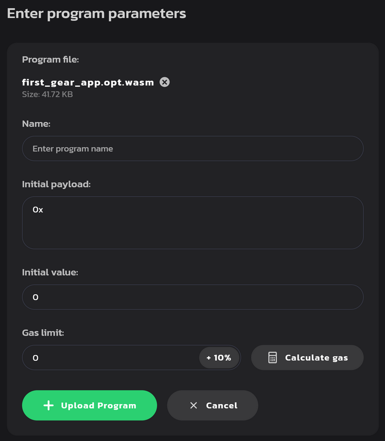
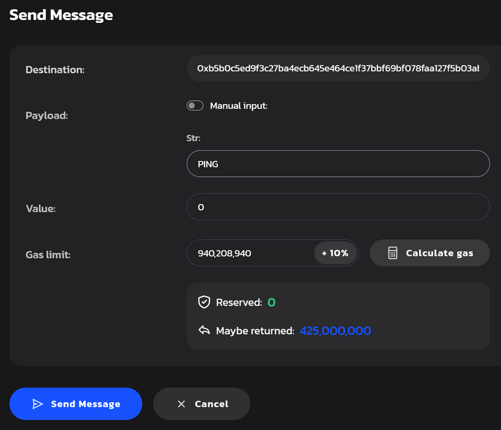
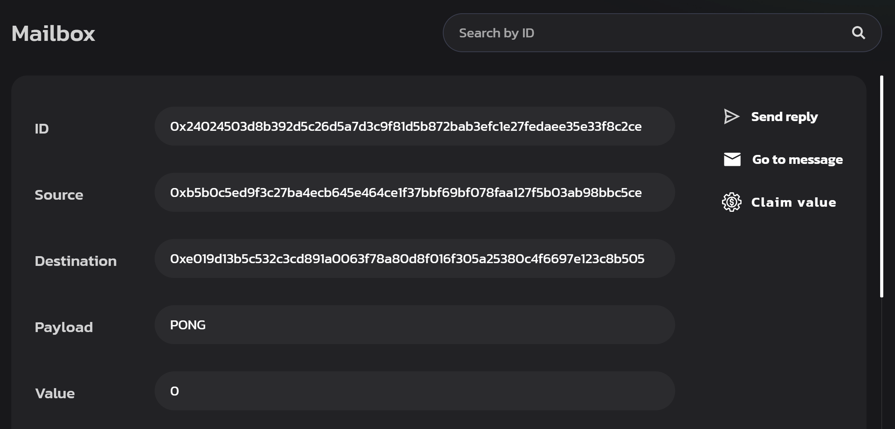

# 5 分钟入门

本文提供了在 Gear 协议支持的网络（如[Vara 网络](https://vara-network.io/)）上运行智能合约的介绍。它将会指导你如何编写智能合约，将其编译为 Wasm，并部署到 Gear 网络。

## 前期准备

1. Linux 用户一般应该根据其发行版的文档安装 `GCC` 和 `Clang`。此外，还需要安装 `binaryen` 工具集，其中包含所需的 wasm-opt 工具。

    比如，在 Ubuntu 上，使用：
    ```bash
    sudo apt install -y clang build-essential binaryen
    ```

    在 macOS 上，你可以通过运行以下命令，得到一个编译器工具集和 `binaryen`：

    ```bash
    xcode-select --install
    brew install binaryen
    ```

2. 确保你已经安装了在 Rust 中构建智能合约所需的所有工具。我们将使用[Rustup](https://rustup.rs/) 来安装 Rust 编译器。

```bash
curl --proto '=https' --tlsv1.2 -sSf https://sh.rustup.rs | sh
```

3. 现在，让我们为 `rustup` 安装一个 `nightly` 版本，因为 `Gear` 使用了一些 `rustup` 提供的最新功能。

```bash
rustup toolchain add nightly
```

4. 我们需要把 Rust 智能合约编译为 Wasm，所以需要一个 Wasm 编译器。让我们将 Wasm 编译器添加到工具链中。

```bash
rustup target add wasm32-unknown-unknown --toolchain nightly
```

**_注意_**：如果你使用 Windows，请下载并安装 [Build Tools for Visual Studio](https://visualstudio.microsoft.com/downloads/?q=build+tools)。

## 创建第一个 Gear 智能合约

1. 为了方便起见，建议你为所有与 Gear 有关的内容创建一个专用目录。文章的其余部分将假设你正在使用建议的路径。输入以下命令，在你的 Home 目录中创建一个文件夹。

```bash
mkdir -p ~/gear
```

2. 现在让我们在 `gear` 文件夹内，创建 `contracts` 文件夹，然后通过 `cd` 切换进文件夹

```bash
mkdir -p ~/gear/contracts
cd ~/gear/contracts
```

3. 下一步将是为合约建立一个 Rust 库

```bash
cargo new first-gear-app --lib
cargo new first-gear-app/io --lib
cargo new first-gear-app/state --lib
```

`gear/contracts` 目录树应该是这样的：

    ```bash
    └── first-gear-app
        ├── Cargo.toml
        └── src
        │   └── lib.rs
        ├── io
        │   ├── Cargo.toml
        │   └── src
        │       └── lib.rs
        └── state
            ├── Cargo.toml
            └── src
                └── lib.rs
    ```


4. 现在开始写一些代码。用你喜欢的编辑器打开 `first-gear-app`，我们使用`VS Code`。对于 `VS Code` 编辑器，请输入：

```bash
code ~/gear/contracts/first-gear-app
```

5. 在 `first-gear-app` 文件夹内，创建 `build.rs` 文件，并粘贴以下代码：

```rust
fn main() {
    gear_wasm_builder::build_with_metadata::<demo_ping_io::DemoPingMetadata>();
}
```

 为使合约可以正确地创建，请配置 `Cargo.toml`：

```toml
    [package]
    name = "first-gear-app"
    version = "0.1.0"
    authors = ["Gear Technologies"]
    edition = "2021"
    license = "MIT"

    [dependencies]
    gstd = { git = "https://github.com/gear-tech/gear.git", branch = "testnet", features = ["debug"] }

    [dev-dependencies]
    gtest = { git = "https://github.com/gear-tech/gear.git", branch = "testnet" }

    [build-dependencies]
    demo-ping-io = { path = "io" }
    gear-wasm-builder = { git = "https://github.com/gear-tech/gear.git", branch = "testnet" }

    [features]
    # Used for inserting constants with WASM binaries (NOT paths) of the contract in
    # the root crate. Usually these constants used in gclient tests instead of
    # strings with paths to the binaries in the "target" directory. If you don't
    # like this approach or don't use gclient tests, you can freely remove this
    # feature from here and from the rest of the code.
    binary-vendor = []

    # It's necessary to include all metawasm crates in the workspace section,
    # otherwise they'll be ignored by Cargo and won't be built.
    [workspace]
    members = [
        "state"
    ]
```

6. 用第一个智能合约的代码替换 `first-gear-app` 文件夹中 `lib.rs` 的默认内容。

向这个简单的智能合约发送 `PING` 消息，会收到 `PONG` 消息作为回应。在编辑器中打开 `src/lib.rs` 并粘贴以下代码：

```rust
    use gstd::{debug, msg, prelude::*};

    static mut MESSAGE_LOG: Vec<String> = vec![];

    #[no_mangle]
    extern "C" fn handle() {
        let new_msg = String::from_utf8(msg::load_bytes().expect("Invalid message"))
            .expect("Unable to create string");

        if new_msg == "PING" {
            msg::reply_bytes("PONG", 0).expect("Unable to reply");
        }

        unsafe {
            MESSAGE_LOG.push(new_msg);

            debug!("{:?} total message(s) stored: ", MESSAGE_LOG.len());

            for log in &MESSAGE_LOG {
                debug!(log);
            }
        }
    }

    #[no_mangle]
    extern "C" fn state() {
        msg::reply(unsafe { MESSAGE_LOG.clone() }, 0)
            .expect("Failed to encode or reply with `<AppMetadata as Metadata>::State` from `state()`");
    }

    #[no_mangle]
    extern "C" fn metahash() {
        msg::reply::<[u8; 32]>(include!("../.metahash"), 0)
            .expect("Failed to encode or reply with `[u8; 32]` from `metahash()`");
    }

    #[cfg(test)]
    mod tests {
        extern crate std;

        use gtest::{Log, Program, System};

        #[test]
        fn it_works() {
            let system = System::new();
            system.init_logger();

            let program = Program::current(&system);

            let res = program.send_bytes(42, "INIT");
            assert!(res.log().is_empty());

            let res = program.send_bytes(42, "PING");
            let log = Log::builder().source(1).dest(42).payload_bytes("PONG");
            assert!(res.contains(&log));
        }
    }
```

7. 在 `io` 文件夹：
    1. 替换 `src/lib.rs`的默认内容：

    ```rust
    #![no_std]

    use gmeta::{InOut, Metadata};
    use gstd::prelude::*;

    pub struct DemoPingMetadata;

    impl Metadata for DemoPingMetadata {
        type Init = ();
        type Handle = InOut<String, String>;
        type Others = ();
        type Reply = ();
        type Signal = ();
        type State = Vec<String>;
    }
    ```

    2. 替换 `Cargo.toml`的内容：

    ```rust
    [package]
    name = "demo-ping-io"
    version = "0.1.0"
    edition = "2021"
    authors = ["Gear Technologies"]
    license = "MIT"

    [dependencies]
    gmeta = { git = "https://github.com/gear-tech/gear.git", branch = "testnet" }
    gstd = { git = "https://github.com/gear-tech/gear.git", branch = "testnet" }
    ```

8. 在 `state` 文件夹：

    1. 创建 `build.rs` 文件，并输入以下内容：

    ```rust
    fn main() {
        gear_wasm_builder::build_metawasm();
    }
    ```

    2. 替换 `src/lib.rs` 的默认内容：

    ```rust
    #![no_std]

    use demo_ping_io::*;
    use gmeta::{metawasm, Metadata};
    use gstd::prelude::*;

    #[metawasm]
    pub mod metafns {
        pub type State = <DemoPingMetadata as Metadata>::State;

        pub fn get_first_message(state: State) -> String {
            state.first().expect("Message log is empty!").to_string()
        }

        pub fn get_last_message(state: State) -> String {
            state.last().expect("Message log is empty!").to_string()
        }

        pub fn get_messages_len(state: State) -> u64 {
            state.len() as u64
        }

        pub fn get_message(state: State, index: u64) -> String {
            state
                .get(index as usize)
                .expect("Invalid index!")
                .to_string()
        }
    }
    ```

    3. 替换 `Cargo.toml` ：

    ```rust
    [package]
    name = "demo-ping-state"
    version = "0.1.0"
    edition = "2021"
    license = "MIT"
    authors = ["Gear Technologies"]

    [dependencies]
    gstd = { git = "https://github.com/gear-tech/gear.git", branch = "testnet" }
    gmeta = { git = "https://github.com/gear-tech/gear.git", branch = "testnet", features = ["codegen"] }
    demo-ping-io = { path = "../io" }

    [build-dependencies]
    gear-wasm-builder = { git = "https://github.com/gear-tech/gear.git", branch = "testnet", features = ["metawasm"] }
    ```

9. 然后，将合约代码编译为 Wasm

```bash
cd ~/gear/contracts/first-gear-app/
cargo build --release
```

如果一切顺利，工作目录应该有一个 `target` 目录，如下所示：

```
    ├── meta.txt
    ├── target
        ├── CACHEDIR.TAG
        ├── meta.txt
        ├── release
        │   └── ...
        └── wasm32-unknown-unknown
            └── release
                ├── ...
                ├── first_gear_app.wasm      <---- this is our built .wasm file
                ├── first_gear_app.opt.wasm  <---- this is optimized .wasm file
                └── first_gear_app.meta.wasm <---- this is legacy meta .wasm file
```

`target/wasm32-unknown-unknown/release` 目录内包含了 3 个 Wasm 文件：

- `first_gear_app.opt.wasm` aaa 是优化后的 Wasm 文件，会上传到区块链上

- `meta.txt` 包含与程序交互所需的元数据

- `first_gear_app.wasm`是从源文件构建的 Wasm 二进制文件

- `first_gear_app.meta.wasm` 包含与程序交互所需的元数据

## 向测试网上部署合约

Gear 提供了一个演示应用程序，实现了与 Gear 网络中智能合约互动的所有功能，可以通过 [idea.gear-tech.io](https://idea.gear-tech.io) 访问。

### 创建账户

1. 通过 [https://polkadot.js.org/extension/](https://polkadot.js.org/extension/) 为你的浏览器下载 Polkadot 扩展插件。这个扩展插件可以管理账户并允许用这些账户签名交易。它是一个安全的工具，允许将你的账户注入到任何基于 Substrate 的应用程序。它不执行钱包功能，例如，发送资金。

2. 下载完成后，点击 <kbd>+</kbd> 来创建新的账户：


3. 确保你安全的保存了 12 个单词的助记词。


4. 选择合适的网络 - 选择 "Allow to use on any chain"。为这个账户提供任何名称和密码，并点击 "Add the account with the generated seed" 来完成账户注册。


5. 前往 **[idea.gear-tech.io](https://idea.gear-tech.io)**。系统将提示你授予 Gear Tech 应用程序对你账户的访问权，点击 "Yes, allow this application access" 。


6. 确定链接的是 `Gear Staging Testnet V7` 网络。网络名称在页面的左下角。


7. 你可以通过点击网络名称来切换网络。


8. 点击右上方的 `Connect` 按钮，选择一个账户，连接到 Gear Tech。


9. 根据 Actor 模型，智能合约通过消息上传到网络。Gear 节点在消息处理过程中会收取一定的 gas。账户需要有足够的资金来上传智能合约到 `TestNet`。点击下面的按钮来获取测试币：

    

    窗口的底部会出现一个关于成功获得余额的通知。你还可以在右上角的账户名称旁边看到当前的账户余额。

    

### 上传合约

1. 当你的账户余额足够时，点击 <kbd>Upload program</kbd> 并找到上面提到的 `.opt.wasm` 文件。同时上传`meta.txt`文件。

    

2. 指定程序名称并点击 <kbd>Calculate Gas</kbd> 按钮。Gas limit 将自动设置。现在点击<kbd>Upload program</kbd>按钮。

    

3. 签署交易，将合约上传到 Gear 网络。此外，签署合约并将元数据上传到 Gear 演示环境，以便可以使用该合约。为方便起见，建议勾选 `Remember my password for the next 15 minutes`。

    

:::note


上传后，如果合约名称前面有红点，代表初始化错误。请再次上传合约，并**加大 Gas limit**。

:::

4. 合约上传后，前往 `Programs` 并找到你的合约。

    

### 向合约发送消息

1. 现在，尝试向新上传的合约发送一条消息，看看它是如何响应的！点击<kbd>Send message</kbd> 按钮。

2. 在打开的对话框的 `Payload` 字段中输入 `PING`。点击<kbd>Calculate Gas</kbd>按钮，Gas limit 会自动设置。现在点击<kbd>Send Message</kbd> 按钮。

    

3. 签名消息，发送交易，如 **Upload Program** 部分的第 3 步所示。

4. 成功处理消息后，你将看到对应的日志消息：

    

5. 点击<kbd>Mailbox</kbd>键进入点击，找到回复的消息。

    

    :::note

    根据 gas 限制，回复消息在 mailbox 中的时间有限。如果你没有看到回复，请尝试重新发送 `PING` 消息并增加 gas limit，并在发送消息后立即转到 mailbox。

    :::

---

## 延伸阅读

有关 Gear 编写智能合约以及智能合约背后的细节，请阅读[这篇文章](/docs/developing-contracts/executable-functions)。
